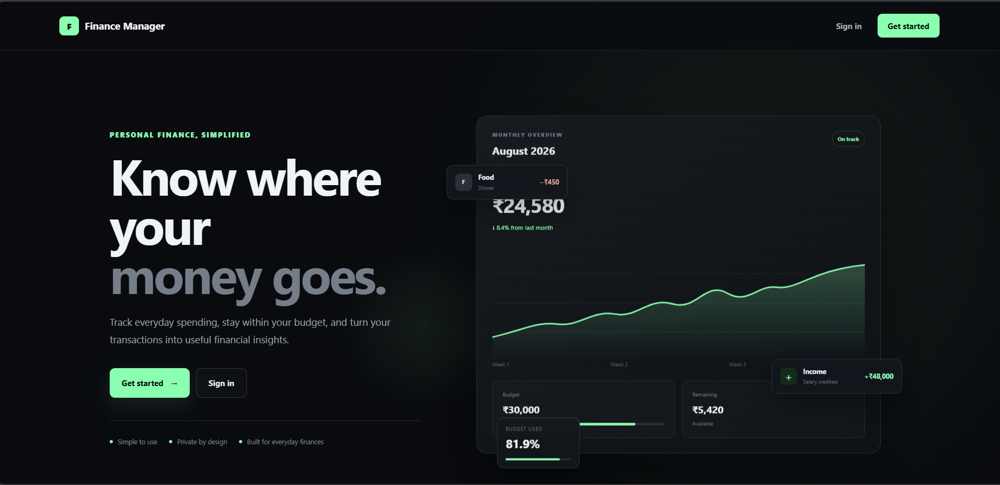
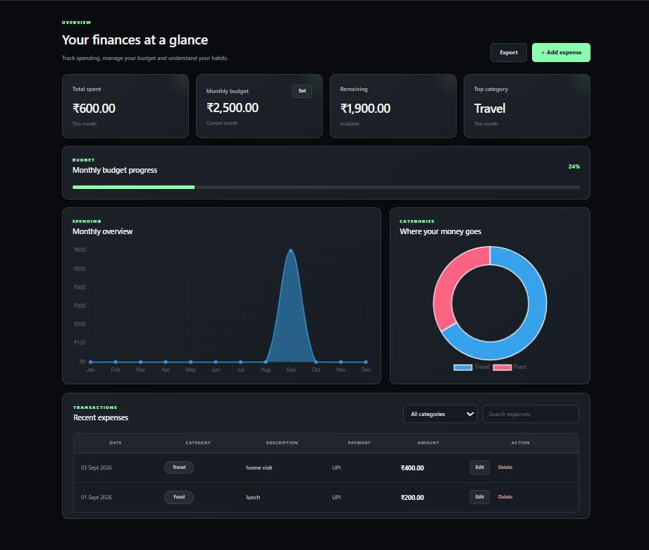
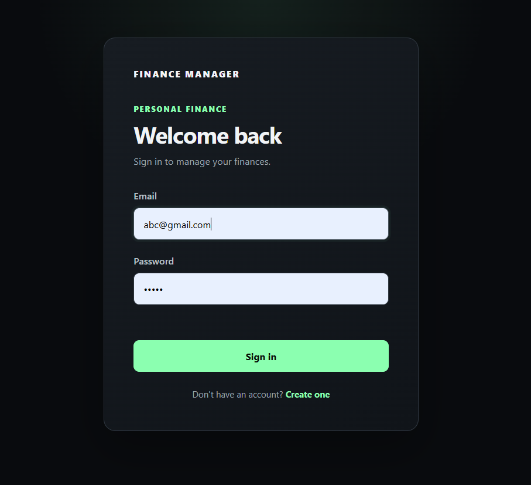

# Personal Finance Manager

A full-stack web application for managing personal expenses, setting monthly budgets, and visualizing spending patterns through an interactive dashboard.

## ✨ Features

- User registration and login
- JWT-based authentication
- Secure password hashing with bcrypt
- Add, edit, and delete expenses
- Expense categories and payment methods
- Search and filter transactions
- Monthly budget management
- Budget progress tracking
- Monthly spending analytics
- Category-wise spending visualization
- Export expenses to Excel
- Responsive and modern UI

## 🛠️ Tech Stack

### Frontend

- HTML
- CSS
- JavaScript
- Chart.js
- ExcelJS

### Backend

- Node.js
- Express.js
- REST APIs
- JWT
- bcrypt

### Database

- SQLite

## 🏗️ Architecture

```text
                 Personal Finance Manager
                           │
                           ▼
                     Frontend
                HTML / CSS / JavaScript
                           │
                     REST API Requests
                           │
                           ▼
                    Express.js Server
                    ┌──────┼──────┐
                    │      │      │
                    ▼      ▼      ▼
                 Auth   Expenses  Budget
                    │      │      │
                    └──────┼──────┘
                           ▼
                      SQLite Database


## 📸 Screenshots

### Landing Page



### Dashboard



### Login Page


```
